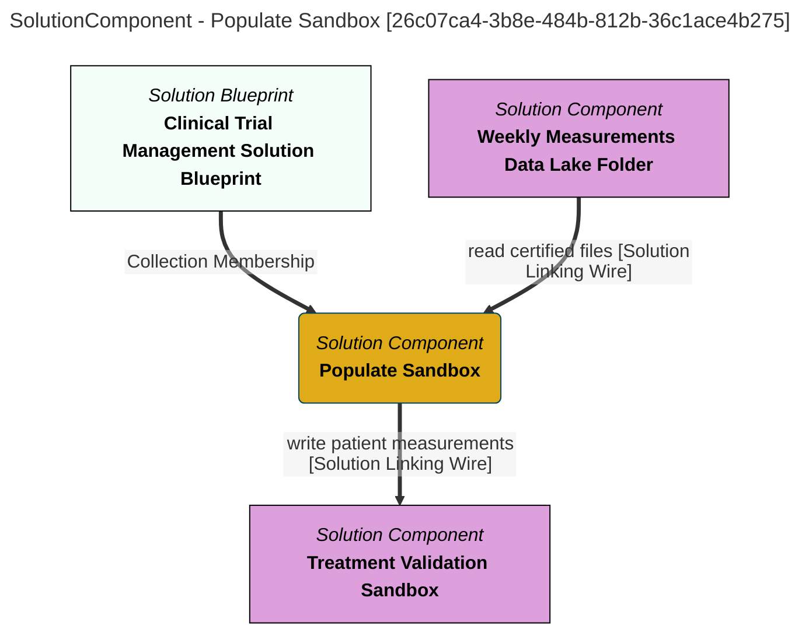

```mermaid
---
title: SolutionComponent - Populate Sandbox [26c07ca4-3b8e-484b-812b-36c1ace4b275]
---
flowchart TD
%%{init: {"flowchart": {"htmlLabels": false}} }%%

1@{ shape: rounded, label: "*Solution Component*
**Populate Sandbox**"}
2@{ shape: rect, label: "*Solution Blueprint*
**Clinical Trial Management Solution Blueprint**"}
2==>|"Collection Membership"|1
3@{ shape: rect, label: "*Solution Component*
**Treatment Validation Sandbox**"}
1==>|"write patient measurements [Solution Linking Wire]"|3
4@{ shape: rect, label: "*Solution Component*
**Weekly Measurements Data Lake Folder**"}
4==>|"read certified files [Solution Linking Wire]"|1
style 1 color:#000000, fill:#e0ab18, stroke:#004563
style 2 color:#000000, fill:#f5fffa, stroke:#000000
style 3 color:#000000, fill:#dda0dd, stroke:#000000
style 4 color:#000000, fill:#dda0dd, stroke:#000000
```
> Populate Sandbox: A process that copies certified files from the hospitals into the research team''s sandbox for processing. (Extracted from V1.0)
