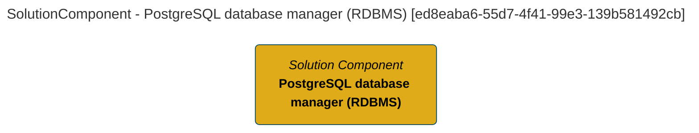

> PostgreSQL database manager (RDBMS): The PostgreSQL capability that manages collections of data called relational databases which in turn are organized into a tabular format and accessed via the Structured Query Language (SQL). (Extracted from 6.0-SNAPSHOT)
