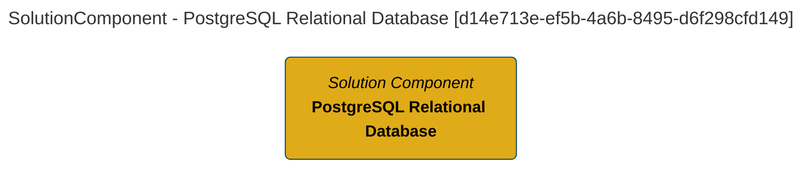

```mermaid
---
title: SolutionComponent - PostgreSQL Relational Database [d14e713e-ef5b-4a6b-8495-d6f298cfd149]
---
flowchart TD
%%{init: {"flowchart": {"htmlLabels": false}} }%%

1@{ shape: rounded, label: "*Solution Component*
**PostgreSQL Relational Database**"}
style 1 color:#000000, fill:#e0ab18, stroke:#004563
click 1 "https://www.postgresql.org/" "Click for more documentation" _blank
```
> PostgreSQL Relational Database: A database hosted on a PostgreSQL server. (Extracted from 6.0-SNAPSHOT)
