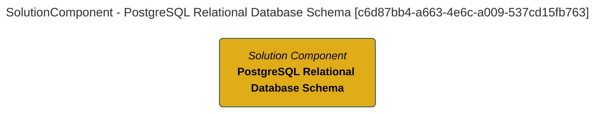

```mermaid
---
title: SolutionComponent - PostgreSQL Relational Database Schema [c6d87bb4-a663-4e6c-a009-537cd15fb763]
---
flowchart TD
%%{init: {"flowchart": {"htmlLabels": false}} }%%

1@{ shape: rounded, label: "*Solution Component*
**PostgreSQL Relational Database Schema**"}
style 1 color:#000000, fill:#e0ab18, stroke:#004563
click 1 "https://www.postgresql.org/" "Click for more documentation" _blank
```
> PostgreSQL Relational Database Schema: A database schema hosted on a PostgreSQL relational database server capable of being called through a JDBC Driver. (Extracted from 6.0-SNAPSHOT)
