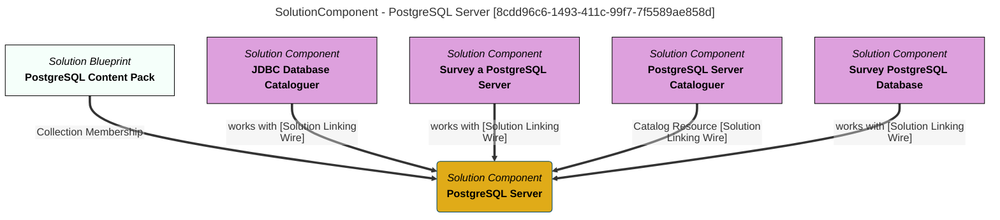

```mermaid
---
title: SolutionComponent - PostgreSQL Server [8cdd96c6-1493-411c-99f7-7f5589ae858d]
---
flowchart TD
%%{init: {"flowchart": {"htmlLabels": false}} }%%

1@{ shape: rounded, label: "*Solution Component*
**PostgreSQL Server**"}
2@{ shape: rect, label: "*Solution Blueprint*
**PostgreSQL Content Pack**"}
2==>|"Collection Membership"|1
3@{ shape: rect, label: "*Solution Component*
**JDBC Database Cataloguer**"}
3==>|"works with [Solution Linking Wire]"|1
4@{ shape: rect, label: "*Solution Component*
**Survey a PostgreSQL Server**"}
4==>|"works with [Solution Linking Wire]"|1
5@{ shape: rect, label: "*Solution Component*
**PostgreSQL Server Cataloguer**"}
5==>|"Catalog Resource [Solution Linking Wire]"|1
6@{ shape: rect, label: "*Solution Component*
**Survey PostgreSQL Database**"}
6==>|"works with [Solution Linking Wire]"|1
style 1 color:#000000, fill:#e0ab18, stroke:#004563
style 2 color:#000000, fill:#f5fffa, stroke:#000000
style 3 color:#000000, fill:#dda0dd, stroke:#000000
style 4 color:#000000, fill:#dda0dd, stroke:#000000
style 5 color:#000000, fill:#dda0dd, stroke:#000000
style 6 color:#000000, fill:#dda0dd, stroke:#000000
click 1 "https://www.postgresql.org/" "Click for more documentation" _blank
click 3 "https://egeria-project.org/concepts/integration-connector/" "Click for more documentation" _blank
click 4 "https://egeria-project.org/concepts/governance-action-type/" "Click for more documentation" _blank
click 5 "https://egeria-project.org/concepts/integration-connector/" "Click for more documentation" _blank
click 6 "https://egeria-project.org/concepts/governance-action-type/" "Click for more documentation" _blank
```
> PostgreSQL Server: A database server running the PostgreSQL software. (Extracted from 6.0-SNAPSHOT)
