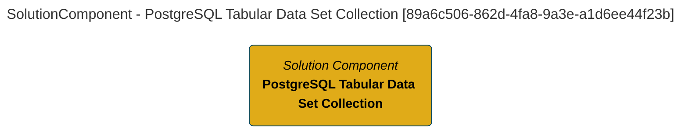

```mermaid
---
title: SolutionComponent - PostgreSQL Tabular Data Set Collection [89a6c506-862d-4fa8-9a3e-a1d6ee44f23b]
---
flowchart TD
%%{init: {"flowchart": {"htmlLabels": false}} }%%

1@{ shape: rounded, label: "*Solution Component*
**PostgreSQL Tabular Data Set Collection**"}
style 1 color:#000000, fill:#e0ab18, stroke:#004563
click 1 "https://www.postgresql.org/" "Click for more documentation" _blank
```
> PostgreSQL Tabular Data Set Collection: A database schema hosted on a PostgreSQL relational database server that has the tabular data set collection interface. (Extracted from 6.0-SNAPSHOT)
