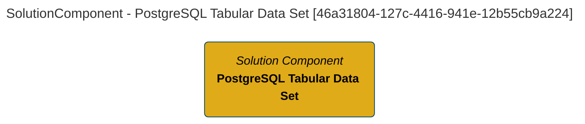

```mermaid
---
title: SolutionComponent - PostgreSQL Tabular Data Set [46a31804-127c-4416-941e-12b55cb9a224]
---
flowchart TD
%%{init: {"flowchart": {"htmlLabels": false}} }%%

1@{ shape: rounded, label: "*Solution Component*
**PostgreSQL Tabular Data Set**"}
style 1 color:#000000, fill:#e0ab18, stroke:#004563
click 1 "https://www.postgresql.org/" "Click for more documentation" _blank
```
> PostgreSQL Tabular Data Set: A database table hosted on a PostgreSQL relational database server that has the tabular data set interface. (Extracted from 6.0-SNAPSHOT)
