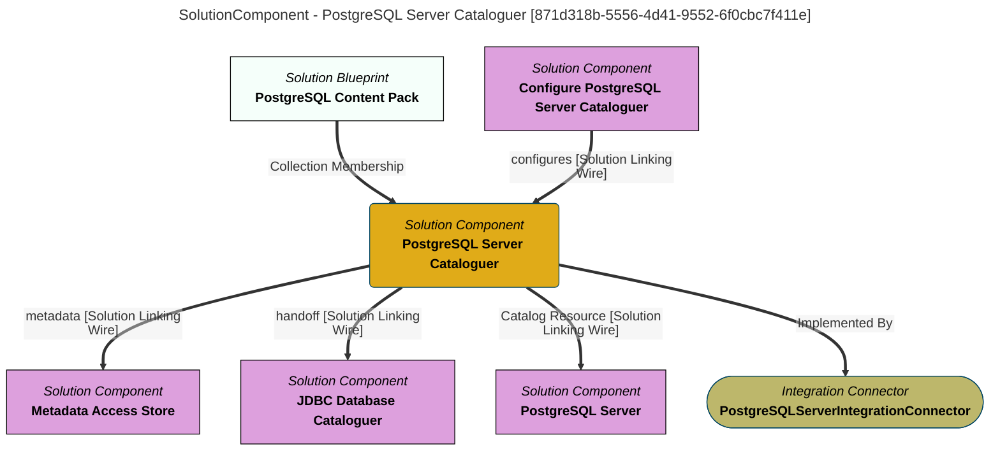

> PostgreSQL Server Cataloguer: Maintains the open metadata elements that represent the databases in a PostgreSQL server.  Hands off the cataloguing of the schemas, tables and columns of each database to the ''PostgreSQL Database Cataloguer''. (Extracted from 6.0-SNAPSHOT)
