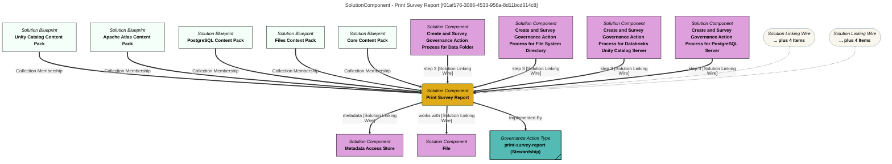

```mermaid
---
title: SolutionComponent - Print Survey Report [f01af176-3086-4533-956a-8d11bcd314c8]
---
flowchart TD
%%{init: {"flowchart": {"htmlLabels": false}} }%%

1@{ shape: rounded, label: "*Solution Component*
**Print Survey Report**"}
2@{ shape: rect, label: "*Solution Blueprint*
**Unity Catalog Content Pack**"}
2==>|"Collection Membership"|1
3@{ shape: rect, label: "*Solution Blueprint*
**Apache Atlas Content Pack**"}
3==>|"Collection Membership"|1
4@{ shape: rect, label: "*Solution Blueprint*
**PostgreSQL Content Pack**"}
4==>|"Collection Membership"|1
5@{ shape: rect, label: "*Solution Blueprint*
**Files Content Pack**"}
5==>|"Collection Membership"|1
6@{ shape: rect, label: "*Solution Blueprint*
**Core Content Pack**"}
6==>|"Collection Membership"|1
7@{ shape: rect, label: "*Solution Component*
**Create and Survey Governance Action Process for Data Folder**"}
7==>|"step 3 [Solution Linking Wire]"|1
8@{ shape: rect, label: "*Solution Component*
**Metadata Access Store**"}
1==>|"metadata [Solution Linking Wire]"|8
9@{ shape: rect, label: "*Solution Component*
**Create and Survey Governance Action Process for File System Directory**"}
9==>|"step 3 [Solution Linking Wire]"|1
10@{ shape: rect, label: "*Solution Component*
**Create and Survey Governance Action Process for Databricks Unity Catalog Server**"}
10==>|"step 3 [Solution Linking Wire]"|1
11@{ shape: rect, label: "*Solution Component*
**File**"}
1==>|"works with [Solution Linking Wire]"|11
12@{ shape: rect, label: "*Solution Component*
**Create and Survey Governance Action Process for PostgreSQL Server**"}
12==>|"step 3 [Solution Linking Wire]"|1
13@{ shape: stadium, label: "*Solution Linking Wire*
**... plus 4 Items**"}
13-.->1
14@{ shape: tag-rect, label: "*Governance Action Type*
**print-survey-report (Stewardship)**"}
1==>|"Implemented By"|14
15@{ shape: stadium, label: "*Solution Linking Wire*
**... plus 4 Items**"}
15-.->1
style 11 color:#000000, fill:#dda0dd, stroke:#000000
style 12 color:#000000, fill:#dda0dd, stroke:#000000
style 13 color:#000000, fill:#F9F7ED, stroke:#b7c0c7
style 14 color:#000000, fill:#53bbb4, stroke:#000000
style 15 color:#000000, fill:#F9F7ED, stroke:#b7c0c7
style 1 color:#000000, fill:#e0ab18, stroke:#004563
style 2 color:#000000, fill:#f5fffa, stroke:#000000
style 3 color:#000000, fill:#f5fffa, stroke:#000000
style 4 color:#000000, fill:#f5fffa, stroke:#000000
style 5 color:#000000, fill:#f5fffa, stroke:#000000
style 6 color:#000000, fill:#f5fffa, stroke:#000000
style 7 color:#000000, fill:#dda0dd, stroke:#000000
style 8 color:#000000, fill:#dda0dd, stroke:#000000
style 9 color:#000000, fill:#dda0dd, stroke:#000000
style 10 color:#000000, fill:#dda0dd, stroke:#000000
click 11 "https://egeria-project.org/types/2/0220-Files-and-Folders/" "Click for more documentation" _blank
click 1 "https://egeria-project.org/concepts/governance-action-type/" "Click for more documentation" _blank
click 12 "https://egeria-project.org/egeria-solutions/leveraging-postgres/overview/" "Click for more documentation" _blank
click 7 "https://egeria-project.org/egeria-solutions/leveraging-files/overview/" "Click for more documentation" _blank
click 8 "https://egeria-project.org/concepts/metadata-access-store/" "Click for more documentation" _blank
click 9 "https://egeria-project.org/egeria-solutions/leveraging-files/overview/" "Click for more documentation" _blank
click 10 "https://egeria-project.org/egeria-solutions/leveraging-unity-catalog/overview/" "Click for more documentation" _blank
```
> Print Survey Report: Print out a survey report as a markdown document. (Extracted from 6.0-SNAPSHOT)
