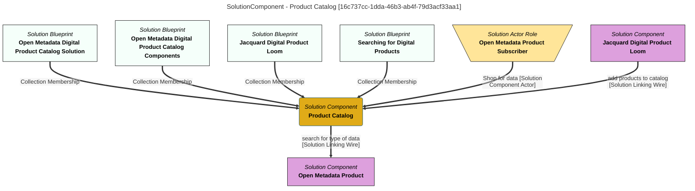

> Product Catalog: Supports the process of locating the appropriate digital product by providing organized, searchable descriptions of the digital products to the product consumers. (Extracted from 6.0-SNAPSHOT)
