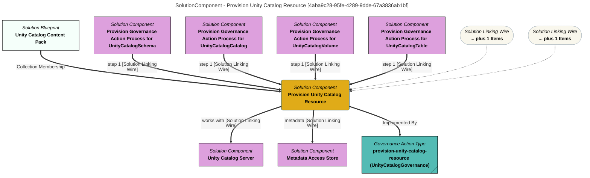

> Provision Unity Catalog Resource: Creates a description of a Unity Catalog resource (such as a volume, table or function) for a particular Unity Catalog Server that will be picked up and added to the Unity Catalog Server by the Unity Catalog integration connector on the next refresh. (Extracted from 6.0-SNAPSHOT)
