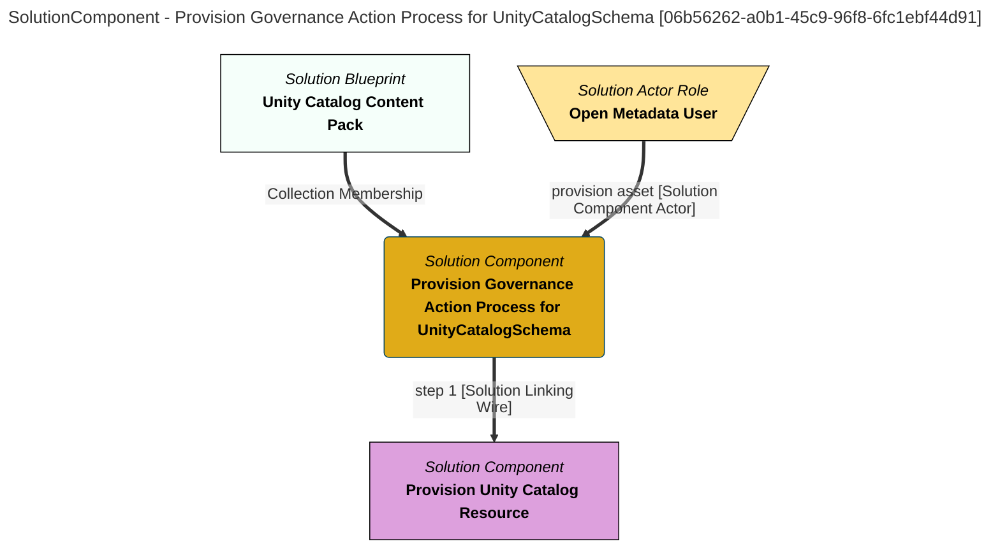

> Provision Governance Action Process for UnityCatalogSchema: Create a DeployedImplementationType{Unity Catalog Schema} element in the correct metadata collection so that it is provisioned into unity catalog. (Extracted from 6.0-SNAPSHOT)
