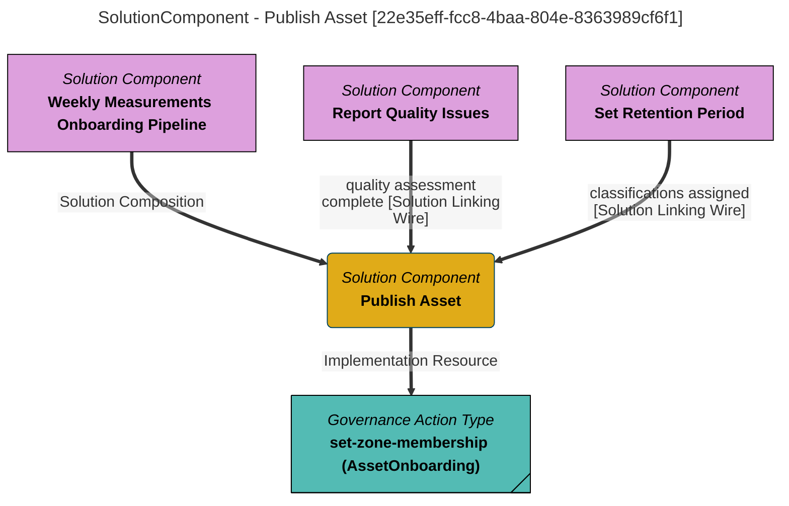

```mermaid
---
title: SolutionComponent - Publish Asset [22e35eff-fcc8-4baa-804e-8363989cf6f1]
---
flowchart TD
%%{init: {"flowchart": {"htmlLabels": false}} }%%

1@{ shape: rounded, label: "*Solution Component*
**Publish Asset**"}
2@{ shape: rect, label: "*Solution Component*
**Weekly Measurements Onboarding Pipeline**"}
2==>|"Solution Composition"|1
3@{ shape: rect, label: "*Solution Component*
**Report Quality Issues**"}
3==>|"quality assessment complete [Solution Linking Wire]"|1
4@{ shape: rect, label: "*Solution Component*
**Set Retention Period**"}
4==>|"classifications assigned [Solution Linking Wire]"|1
5@{ shape: tag-rect, label: "*Governance Action Type*
**set-zone-membership (AssetOnboarding)**"}
1==>|"Implementation Resource"|5
style 1 color:#000000, fill:#e0ab18, stroke:#004563
style 2 color:#000000, fill:#dda0dd, stroke:#000000
style 3 color:#000000, fill:#dda0dd, stroke:#000000
style 4 color:#000000, fill:#dda0dd, stroke:#000000
style 5 color:#000000, fill:#53bbb4, stroke:#000000
```
> Publish Asset: Make the new file visible in the data lake catalog. (Extracted from V1.0)
