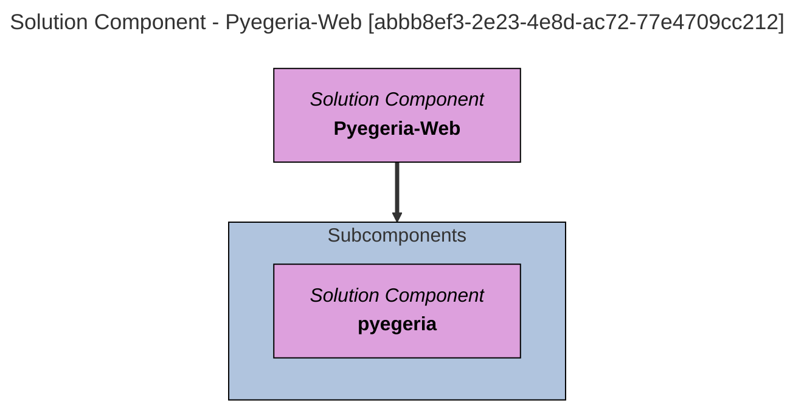

```mermaid
---
title: Solution Component - Pyegeria-Web [abbb8ef3-2e23-4e8d-ac72-77e4709cc212]
---
flowchart TD
%%{init: {"flowchart": {"htmlLabels": false}} }%%

1@{ shape: rect, label: "*Solution Component*
**Pyegeria-Web**"}
subgraph 2 [Subcomponents]
3@{ shape: rect, label: "*Solution Component*
**pyegeria**"}
end
1==>2
style 1 color:#000000, fill:#dda0dd, stroke:#000000
style 2 color:#000000, fill:#b0c4de, stroke:#000000
style 3 color:#000000, fill:#dda0dd, stroke:#000000
click 3 "https://egeria-project.org/concepts/pyegeria/" "Click for more documentation" _blank
```
> Pyegeria-Web: REST-ful service for calling Dr.Egeria from local tools. (Extracted from 6.0-SNAPSHOT)
