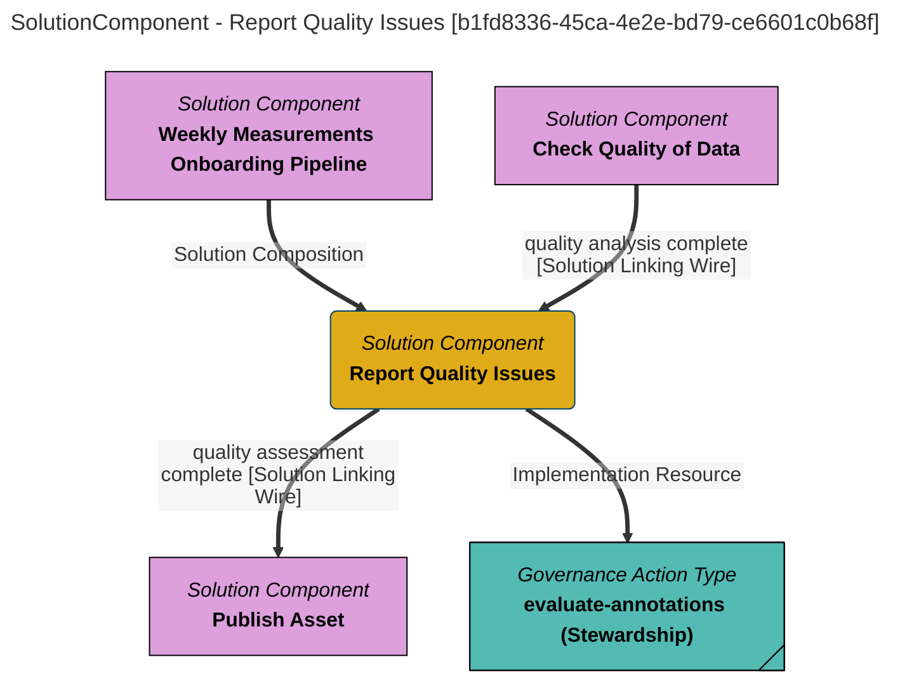

```mermaid
---
title: SolutionComponent - Report Quality Issues [b1fd8336-45ca-4e2e-bd79-ce6601c0b68f]
---
flowchart TD
%%{init: {"flowchart": {"htmlLabels": false}} }%%

1@{ shape: rounded, label: "*Solution Component*
**Report Quality Issues**"}
2@{ shape: rect, label: "*Solution Component*
**Weekly Measurements Onboarding Pipeline**"}
2==>|"Solution Composition"|1
3@{ shape: rect, label: "*Solution Component*
**Publish Asset**"}
1==>|"quality assessment complete [Solution Linking Wire]"|3
4@{ shape: rect, label: "*Solution Component*
**Check Quality of Data**"}
4==>|"quality analysis complete [Solution Linking Wire]"|1
5@{ shape: tag-rect, label: "*Governance Action Type*
**evaluate-annotations (Stewardship)**"}
1==>|"Implementation Resource"|5
style 1 color:#000000, fill:#e0ab18, stroke:#004563
style 2 color:#000000, fill:#dda0dd, stroke:#000000
style 3 color:#000000, fill:#dda0dd, stroke:#000000
style 4 color:#000000, fill:#dda0dd, stroke:#000000
style 5 color:#000000, fill:#53bbb4, stroke:#000000
```
> Report Quality Issues: Create alerts to interested parties if quality issues are detected. (Extracted from V1.0)
