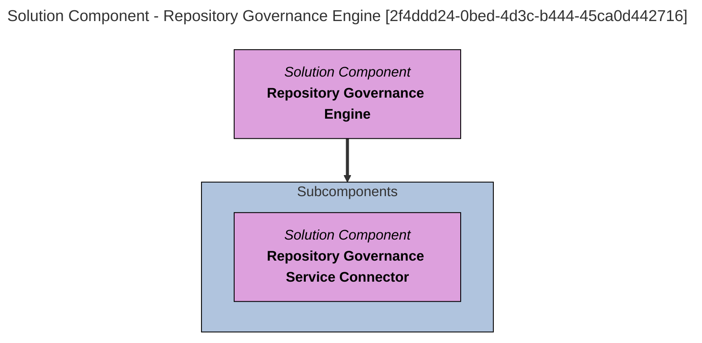

```mermaid
---
title: Solution Component - Repository Governance Engine [2f4ddd24-0bed-4d3c-b444-45ca0d442716]
---
flowchart TD
%%{init: {"flowchart": {"htmlLabels": false}} }%%

1@{ shape: rect, label: "*Solution Component*
**Repository Governance Engine**"}
subgraph 2 [Subcomponents]
3@{ shape: rect, label: "*Solution Component*
**Repository Governance Service Connector**"}
end
1==>2
style 1 color:#000000, fill:#dda0dd, stroke:#000000
style 2 color:#000000, fill:#b0c4de, stroke:#000000
style 3 color:#000000, fill:#dda0dd, stroke:#000000
click 1 "https://egeria-project.org/concepts/repository-governance-engine/" "Click for more documentation" _blank
click 3 "https://egeria-project.org/concepts/repository-governance-service" "Click for more documentation" _blank
```
> Repository Governance Engine: A governance engine that runs repository governance services. (Extracted from 6.0-SNAPSHOT)
