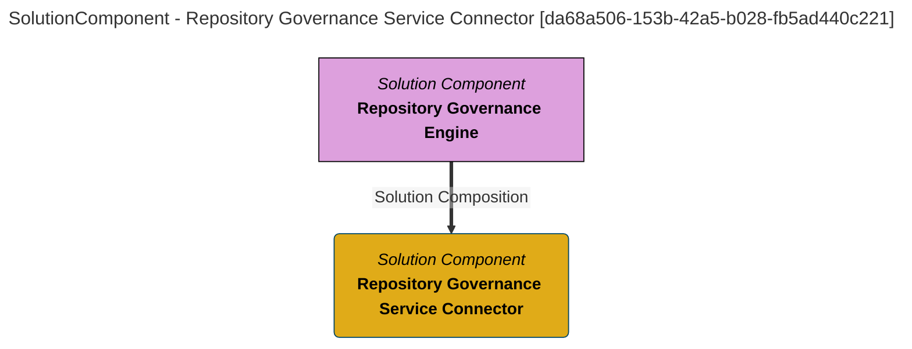

```mermaid
---
title: SolutionComponent - Repository Governance Service Connector [da68a506-153b-42a5-b028-fb5ad440c221]
---
flowchart TD
%%{init: {"flowchart": {"htmlLabels": false}} }%%

1@{ shape: rounded, label: "*Solution Component*
**Repository Governance Service Connector**"}
2@{ shape: rect, label: "*Solution Component*
**Repository Governance Engine**"}
2==>|"Solution Composition"|1
style 1 color:#000000, fill:#e0ab18, stroke:#004563
style 2 color:#000000, fill:#dda0dd, stroke:#000000
click 1 "https://egeria-project.org/concepts/repository-governance-service" "Click for more documentation" _blank
click 2 "https://egeria-project.org/concepts/repository-governance-engine/" "Click for more documentation" _blank
```
> Repository Governance Service Connector: A connector that dynamically governs the activity of the open metadata repositories. (Extracted from 6.0-SNAPSHOT)
