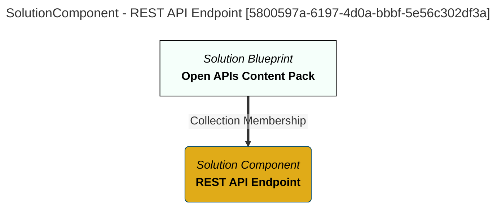

```mermaid
---
title: SolutionComponent - REST API Endpoint [5800597a-6197-4d0a-bbbf-5e56c302df3a]
---
flowchart TD
%%{init: {"flowchart": {"htmlLabels": false}} }%%

1@{ shape: rounded, label: "*Solution Component*
**REST API Endpoint**"}
2@{ shape: rect, label: "*Solution Blueprint*
**Open APIs Content Pack**"}
2==>|"Collection Membership"|1
style 1 color:#000000, fill:#e0ab18, stroke:#004563
style 2 color:#000000, fill:#f5fffa, stroke:#000000
click 1 "https://egeria-project.org/types/0/0026-Endpoints/" "Click for more documentation" _blank
```
> REST API Endpoint: A callable network address supporting the REST protocol. (Extracted from 6.0-SNAPSHOT)
