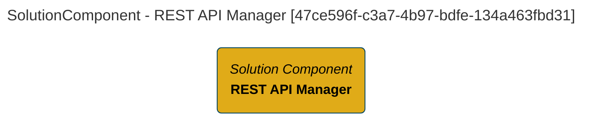

```mermaid
---
title: SolutionComponent - REST API Manager [47ce596f-c3a7-4b97-bdfe-134a463fbd31]
---
flowchart TD
%%{init: {"flowchart": {"htmlLabels": false}} }%%

1@{ shape: rounded, label: "*Solution Component*
**REST API Manager**"}
style 1 color:#000000, fill:#e0ab18, stroke:#004563
click 1 "https://egeria-project.org/types/0/0050-Applications-and-Processes/" "Click for more documentation" _blank
```
> REST API Manager: A software capability that provides callable APIs supporting the REST protocol. (Extracted from 6.0-SNAPSHOT)
