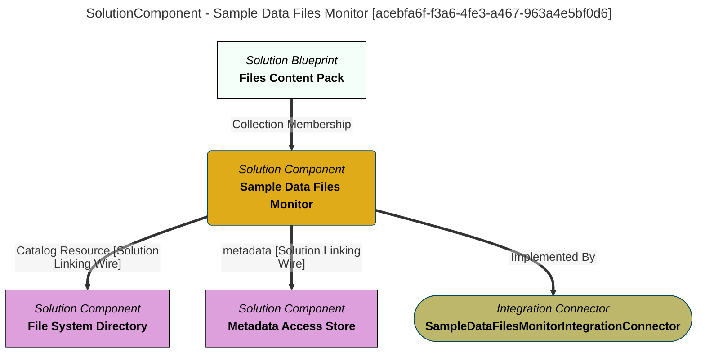

> Sample Data Files Monitor: Catalogs any files added to the ''loading-bay/sample-data'' directory.  This is used to demonstrate how different types of files are catalog in open metadata.  Just drop the files that you want to experiment with into the directory anf they will be catalogued.  Use the Asset Maker API to query the results. (Extracted from 6.0-SNAPSHOT)
