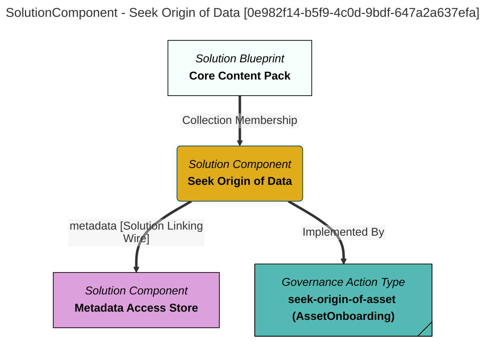

> Seek Origin of Data: Using the lineage relationships, trace back to the source of data for a requested asset.  If a single DigitalResourceOrigin classification is encountered then add it to the asset.  If null, or multiple DigitalResourceOrigin classifications are encountered, raise an error. (Extracted from 6.0-SNAPSHOT)
