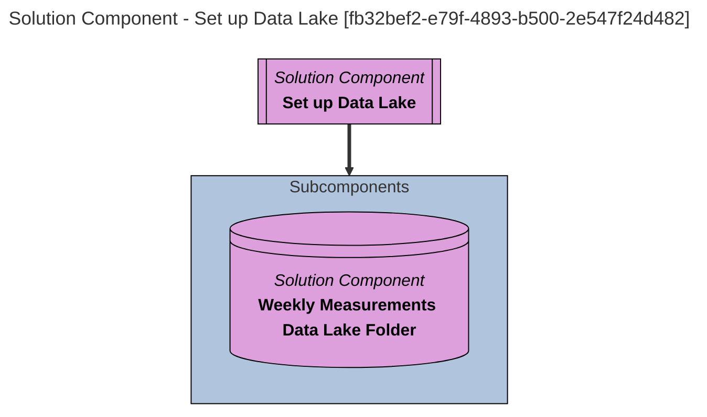

> Set up Data Lake: Set up the data stores for receiving data from the hospitals - this includes the file system directory and Unity Catalog Volume for incoming patient measurements, along with the data set collection for certified measurement files. (Extracted from V1.0)
