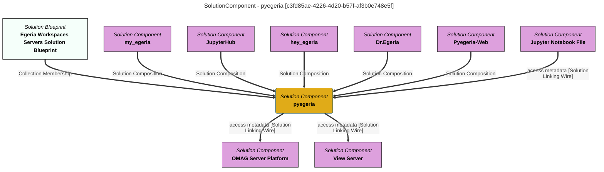

```mermaid
---
title: SolutionComponent - pyegeria [c3fd85ae-4226-4d20-b57f-af3b0e748e5f]
---
flowchart TD
%%{init: {"flowchart": {"htmlLabels": false}} }%%

1@{ shape: rounded, label: "*Solution Component*
**pyegeria**"}
2@{ shape: rect, label: "*Solution Blueprint*
**Egeria Workspaces Servers Solution Blueprint**"}
2==>|"Collection Membership"|1
3@{ shape: rect, label: "*Solution Component*
**my_egeria**"}
3==>|"Solution Composition"|1
4@{ shape: rect, label: "*Solution Component*
**JupyterHub**"}
4==>|"Solution Composition"|1
5@{ shape: rect, label: "*Solution Component*
**hey_egeria**"}
5==>|"Solution Composition"|1
6@{ shape: rect, label: "*Solution Component*
**Dr.Egeria**"}
6==>|"Solution Composition"|1
7@{ shape: rect, label: "*Solution Component*
**Pyegeria-Web**"}
7==>|"Solution Composition"|1
8@{ shape: rect, label: "*Solution Component*
**OMAG Server Platform**"}
1==>|"access metadata [Solution Linking Wire]"|8
9@{ shape: rect, label: "*Solution Component*
**Jupyter Notebook File**"}
9==>|"access metadata [Solution Linking Wire]"|1
10@{ shape: rect, label: "*Solution Component*
**View Server**"}
1==>|"access metadata [Solution Linking Wire]"|10
style 1 color:#000000, fill:#e0ab18, stroke:#004563
style 2 color:#000000, fill:#f5fffa, stroke:#000000
style 3 color:#000000, fill:#dda0dd, stroke:#000000
style 4 color:#000000, fill:#dda0dd, stroke:#000000
style 5 color:#000000, fill:#dda0dd, stroke:#000000
style 6 color:#000000, fill:#dda0dd, stroke:#000000
style 7 color:#000000, fill:#dda0dd, stroke:#000000
style 8 color:#000000, fill:#dda0dd, stroke:#000000
style 9 color:#000000, fill:#dda0dd, stroke:#000000
style 10 color:#000000, fill:#dda0dd, stroke:#000000
click 1 "https://egeria-project.org/concepts/pyegeria/" "Click for more documentation" _blank
click 4 "https://jupyter.org/hub" "Click for more documentation" _blank
click 5 "https://egeria-project.org/user-interfaces/hey-egeria/overview/" "Click for more documentation" _blank
click 8 "https://egeria-project.org/concepts/omag-server-platform/" "Click for more documentation" _blank
click 9 "https://jupyter.org/" "Click for more documentation" _blank
click 10 "https://egeria-project.org/concepts/metadata-access-server/" "Click for more documentation" _blank
```
> pyegeria: Python language library supporting calls to Egeria''s REST APIs. (Extracted from 6.0-SNAPSHOT)
