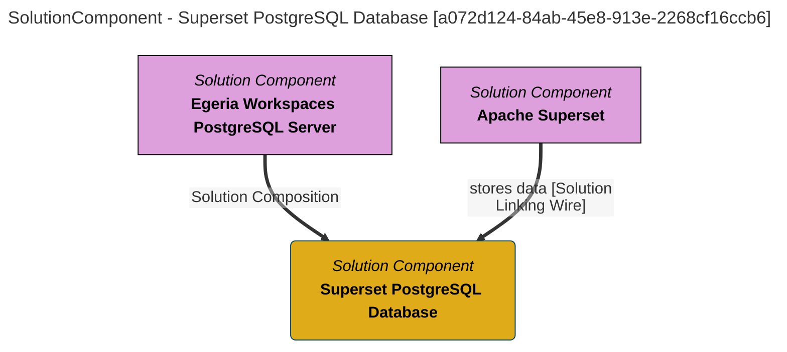

```mermaid
---
title: SolutionComponent - Superset PostgreSQL Database [a072d124-84ab-45e8-913e-2268cf16ccb6]
---
flowchart TD
%%{init: {"flowchart": {"htmlLabels": false}} }%%

1@{ shape: rounded, label: "*Solution Component*
**Superset PostgreSQL Database**"}
2@{ shape: rect, label: "*Solution Component*
**Egeria Workspaces PostgreSQL Server**"}
2==>|"Solution Composition"|1
3@{ shape: rect, label: "*Solution Component*
**Apache Superset**"}
3==>|"stores data [Solution Linking Wire]"|1
style 1 color:#000000, fill:#e0ab18, stroke:#004563
style 2 color:#000000, fill:#dda0dd, stroke:#000000
style 3 color:#000000, fill:#dda0dd, stroke:#000000
click 1 "https://www.postgresql.org/" "Click for more documentation" _blank
click 2 "https://www.postgresql.org/" "Click for more documentation" _blank
click 3 "https://superset.apache.org/" "Click for more documentation" _blank
```
> Superset PostgreSQL Database: This database supports the catalog storage for Apache Superset. (Extracted from 6.0-SNAPSHOT)
