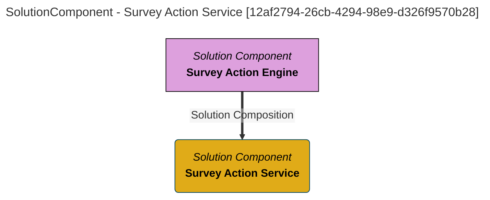

```mermaid
---
title: SolutionComponent - Survey Action Service [12af2794-26cb-4294-98e9-d326f9570b28]
---
flowchart TD
%%{init: {"flowchart": {"htmlLabels": false}} }%%

1@{ shape: rounded, label: "*Solution Component*
**Survey Action Service**"}
2@{ shape: rect, label: "*Solution Component*
**Survey Action Engine**"}
2==>|"Solution Composition"|1
style 1 color:#000000, fill:#e0ab18, stroke:#004563
style 2 color:#000000, fill:#dda0dd, stroke:#000000
click 1 "https://egeria-project.org/concepts/survey-action-service/" "Click for more documentation" _blank
click 2 "https://egeria-project.org/concepts/survey-action-engine/" "Click for more documentation" _blank
```
> Survey Action Service: A connector that coordinates asset surveys. (Extracted from 6.0-SNAPSHOT)
