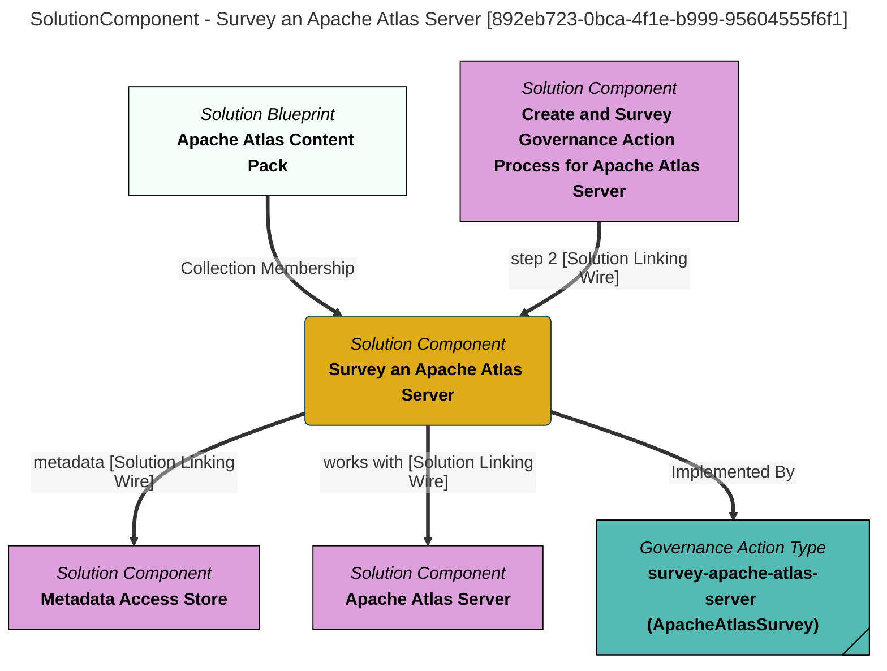

> Survey an Apache Atlas Server: Connect to a requested Apache Atlas server and create a survey report that describes the types and numbers of associated metadata instances stored. (Extracted from 6.0-SNAPSHOT)
