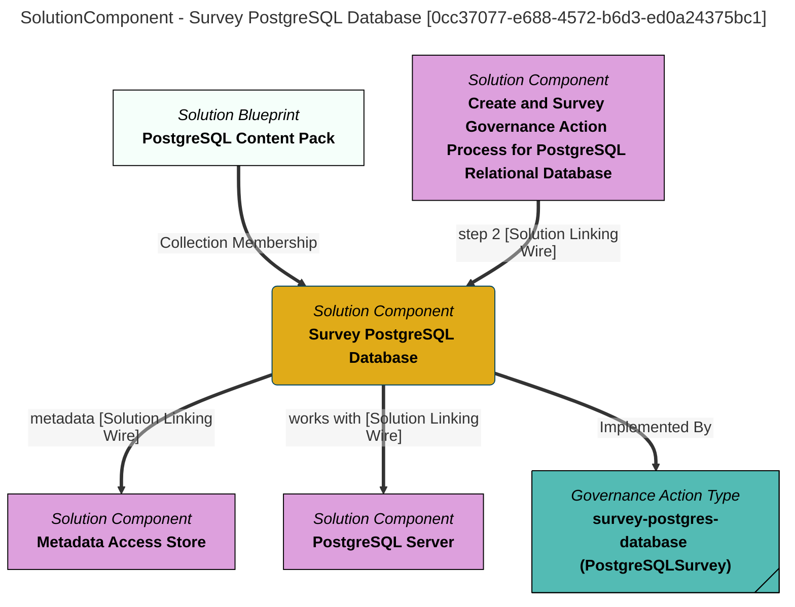

```mermaid
---
title: SolutionComponent - Survey PostgreSQL Database [0cc37077-e688-4572-b6d3-ed0a24375bc1]
---
flowchart TD
%%{init: {"flowchart": {"htmlLabels": false}} }%%

1@{ shape: rounded, label: "*Solution Component*
**Survey PostgreSQL Database**"}
2@{ shape: rect, label: "*Solution Blueprint*
**PostgreSQL Content Pack**"}
2==>|"Collection Membership"|1
3@{ shape: rect, label: "*Solution Component*
**Create and Survey Governance Action Process for PostgreSQL Relational Database**"}
3==>|"step 2 [Solution Linking Wire]"|1
4@{ shape: rect, label: "*Solution Component*
**Metadata Access Store**"}
1==>|"metadata [Solution Linking Wire]"|4
5@{ shape: rect, label: "*Solution Component*
**PostgreSQL Server**"}
1==>|"works with [Solution Linking Wire]"|5
6@{ shape: tag-rect, label: "*Governance Action Type*
**survey-postgres-database (PostgreSQLSurvey)**"}
1==>|"Implemented By"|6
style 1 color:#000000, fill:#e0ab18, stroke:#004563
style 2 color:#000000, fill:#f5fffa, stroke:#000000
style 3 color:#000000, fill:#dda0dd, stroke:#000000
style 4 color:#000000, fill:#dda0dd, stroke:#000000
style 5 color:#000000, fill:#dda0dd, stroke:#000000
style 6 color:#000000, fill:#53bbb4, stroke:#000000
click 1 "https://egeria-project.org/concepts/governance-action-type/" "Click for more documentation" _blank
click 3 "https://egeria-project.org/egeria-solutions/leveraging-postgres/overview/" "Click for more documentation" _blank
click 4 "https://egeria-project.org/concepts/metadata-access-store/" "Click for more documentation" _blank
click 5 "https://www.postgresql.org/" "Click for more documentation" _blank
```
> Survey PostgreSQL Database: Create a survey report of the schemas, tables and columns found in a requested PostgreSQL Database. (Extracted from 6.0-SNAPSHOT)
