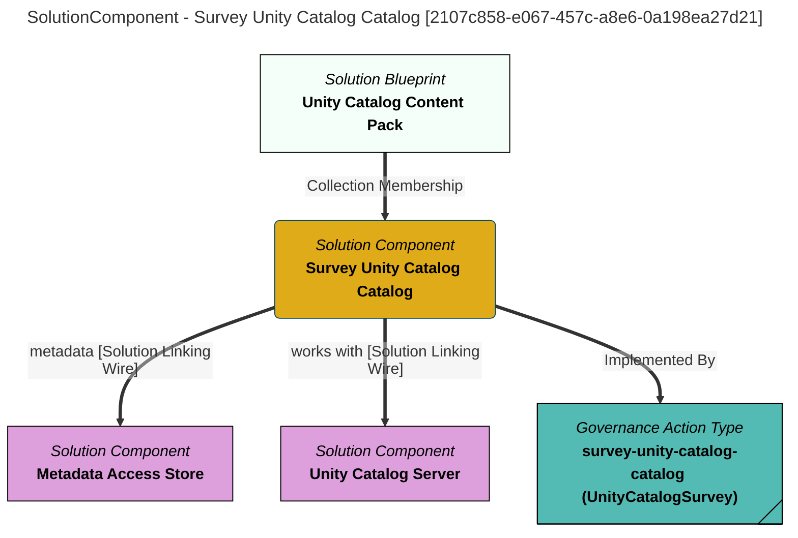

> Survey Unity Catalog Catalog: Connects to a Unity Catalog Server and creates a survey report that summarizes the schemas and data resources found in a requested catalog. (Extracted from 6.0-SNAPSHOT)
