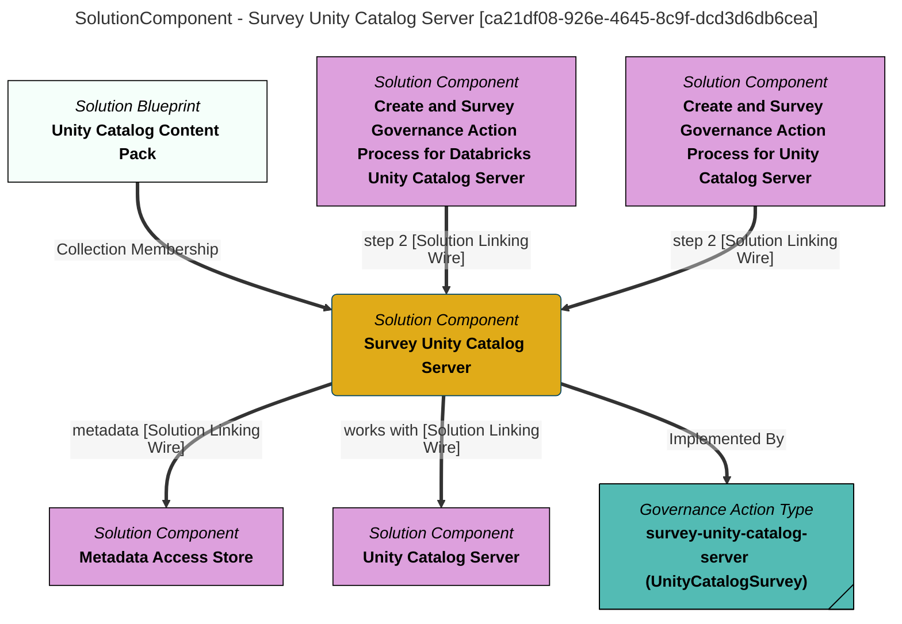

```mermaid
---
title: SolutionComponent - Survey Unity Catalog Server [ca21df08-926e-4645-8c9f-dcd3d6db6cea]
---
flowchart TD
%%{init: {"flowchart": {"htmlLabels": false}} }%%

1@{ shape: rounded, label: "*Solution Component*
**Survey Unity Catalog Server**"}
2@{ shape: rect, label: "*Solution Blueprint*
**Unity Catalog Content Pack**"}
2==>|"Collection Membership"|1
3@{ shape: rect, label: "*Solution Component*
**Metadata Access Store**"}
1==>|"metadata [Solution Linking Wire]"|3
4@{ shape: rect, label: "*Solution Component*
**Create and Survey Governance Action Process for Databricks Unity Catalog Server**"}
4==>|"step 2 [Solution Linking Wire]"|1
5@{ shape: rect, label: "*Solution Component*
**Create and Survey Governance Action Process for Unity Catalog Server**"}
5==>|"step 2 [Solution Linking Wire]"|1
6@{ shape: rect, label: "*Solution Component*
**Unity Catalog Server**"}
1==>|"works with [Solution Linking Wire]"|6
7@{ shape: tag-rect, label: "*Governance Action Type*
**survey-unity-catalog-server (UnityCatalogSurvey)**"}
1==>|"Implemented By"|7
style 1 color:#000000, fill:#e0ab18, stroke:#004563
style 2 color:#000000, fill:#f5fffa, stroke:#000000
style 3 color:#000000, fill:#dda0dd, stroke:#000000
style 4 color:#000000, fill:#dda0dd, stroke:#000000
style 5 color:#000000, fill:#dda0dd, stroke:#000000
style 6 color:#000000, fill:#dda0dd, stroke:#000000
style 7 color:#000000, fill:#53bbb4, stroke:#000000
click 1 "https://egeria-project.org/concepts/governance-action-type/" "Click for more documentation" _blank
click 3 "https://egeria-project.org/concepts/metadata-access-store/" "Click for more documentation" _blank
click 4 "https://egeria-project.org/egeria-solutions/leveraging-unity-catalog/overview/" "Click for more documentation" _blank
click 5 "https://egeria-project.org/egeria-solutions/leveraging-unity-catalog/overview/" "Click for more documentation" _blank
click 6 "https://github.com/unitycatalog/unitycatalog" "Click for more documentation" _blank
```
> Survey Unity Catalog Server: Connects to a Unity Catalog Server and create a survey report that summarizes all the catalogs, schemas and data resources listed. (Extracted from 6.0-SNAPSHOT)
