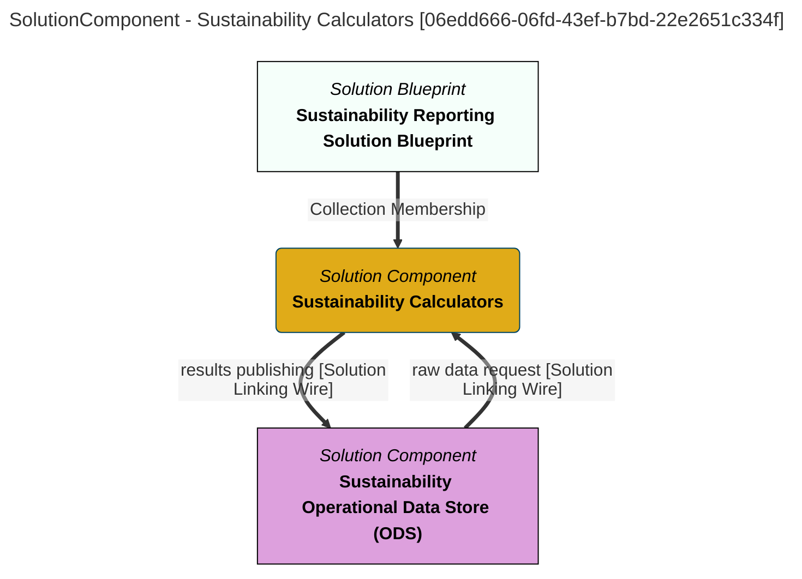

```mermaid
---
title: SolutionComponent - Sustainability Calculators [06edd666-06fd-43ef-b7bd-22e2651c334f]
---
flowchart TD
%%{init: {"flowchart": {"htmlLabels": false}} }%%

1@{ shape: rounded, label: "*Solution Component*
**Sustainability Calculators**"}
2@{ shape: rect, label: "*Solution Blueprint*
**Sustainability Reporting Solution Blueprint**"}
2==>|"Collection Membership"|1
3@{ shape: rect, label: "*Solution Component*
**Sustainability Operational Data Store (ODS)**"}
1==>|"results publishing [Solution Linking Wire]"|3
3==>|"raw data request [Solution Linking Wire]"|1
style 1 color:#000000, fill:#e0ab18, stroke:#004563
style 2 color:#000000, fill:#f5fffa, stroke:#000000
style 3 color:#000000, fill:#dda0dd, stroke:#000000
```
> Sustainability Calculators: Algorithms that calculate the impact of Coco Pharmaceuticals'' operation and the changes that are making a difference. (Extracted from V1.0)
