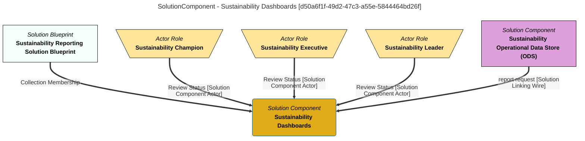

```mermaid
---
title: SolutionComponent - Sustainability Dashboards [d50a6f1f-49d2-47c3-a55e-5844464bd26f]
---
flowchart TD
%%{init: {"flowchart": {"htmlLabels": false}} }%%

1@{ shape: rounded, label: "*Solution Component*
**Sustainability Dashboards**"}
2@{ shape: rect, label: "*Solution Blueprint*
**Sustainability Reporting Solution Blueprint**"}
2==>|"Collection Membership"|1
3@{ shape: trap-t, label: "*Actor Role*
**Sustainability Champion**"}
3==>|"Review Status [Solution Component Actor]"|1
4@{ shape: trap-t, label: "*Actor Role*
**Sustainability Executive**"}
4==>|"Review Status [Solution Component Actor]"|1
5@{ shape: trap-t, label: "*Actor Role*
**Sustainability Leader**"}
5==>|"Review Status [Solution Component Actor]"|1
6@{ shape: rect, label: "*Solution Component*
**Sustainability Operational Data Store (ODS)**"}
6==>|"report request [Solution Linking Wire]"|1
style 1 color:#000000, fill:#e0ab18, stroke:#004563
style 2 color:#000000, fill:#f5fffa, stroke:#000000
style 3 color:#000000, fill:#FFE599, stroke:#000000
style 4 color:#000000, fill:#FFE599, stroke:#000000
style 5 color:#000000, fill:#FFE599, stroke:#000000
style 6 color:#000000, fill:#dda0dd, stroke:#000000
```
> Sustainability Dashboards: Dashboards that illustrate Coco Pharmaceuticals'' sustainability position. (Extracted from V1.0)
