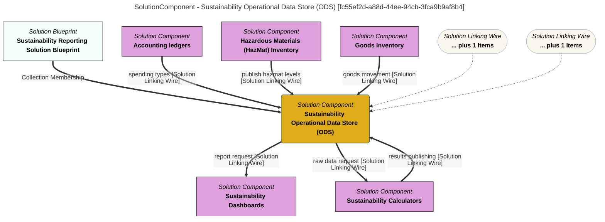

```mermaid
---
title: SolutionComponent - Sustainability Operational Data Store (ODS) [fc55ef2d-a88d-44ee-94cb-3fca9b9af8b4]
---
flowchart TD
%%{init: {"flowchart": {"htmlLabels": false}} }%%

1@{ shape: rounded, label: "*Solution Component*
**Sustainability Operational Data Store (ODS)**"}
2@{ shape: rect, label: "*Solution Blueprint*
**Sustainability Reporting Solution Blueprint**"}
2==>|"Collection Membership"|1
3@{ shape: rect, label: "*Solution Component*
**Accounting ledgers**"}
3==>|"spending types [Solution Linking Wire]"|1
4@{ shape: rect, label: "*Solution Component*
**Sustainability Calculators**"}
4==>|"results publishing [Solution Linking Wire]"|1
5@{ shape: rect, label: "*Solution Component*
**Sustainability Dashboards**"}
1==>|"report request [Solution Linking Wire]"|5
1==>|"raw data request [Solution Linking Wire]"|4
6@{ shape: rect, label: "*Solution Component*
**Hazardous Materials (HazMat) Inventory**"}
6==>|"publish hazmat levels [Solution Linking Wire]"|1
7@{ shape: rect, label: "*Solution Component*
**Goods Inventory**"}
7==>|"goods movement [Solution Linking Wire]"|1
8@{ shape: stadium, label: "*Solution Linking Wire*
**... plus 1 Items**"}
8-.->1
9@{ shape: stadium, label: "*Solution Linking Wire*
**... plus 1 Items**"}
9-.->1
style 1 color:#000000, fill:#e0ab18, stroke:#004563
style 2 color:#000000, fill:#f5fffa, stroke:#000000
style 3 color:#000000, fill:#dda0dd, stroke:#000000
style 4 color:#000000, fill:#dda0dd, stroke:#000000
style 5 color:#000000, fill:#dda0dd, stroke:#000000
style 6 color:#000000, fill:#dda0dd, stroke:#000000
style 7 color:#000000, fill:#dda0dd, stroke:#000000
style 8 color:#000000, fill:#F9F7ED, stroke:#b7c0c7
style 9 color:#000000, fill:#F9F7ED, stroke:#b7c0c7
```
> Sustainability Operational Data Store (ODS): A store for both the raw data needed for the sustainability calculations and the results. (Extracted from V1.0)
