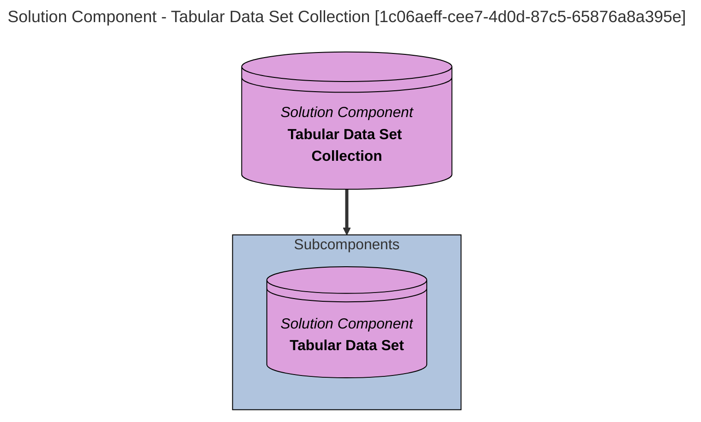

```mermaid
---
title: Solution Component - Tabular Data Set Collection [1c06aeff-cee7-4d0d-87c5-65876a8a395e]
---
flowchart TD
%%{init: {"flowchart": {"htmlLabels": false}} }%%

1@{ shape: lin-cyl, label: "*Solution Component*
**Tabular Data Set Collection**"}
subgraph 2 [Subcomponents]
3@{ shape: lin-cyl, label: "*Solution Component*
**Tabular Data Set**"}
end
1==>2
style 1 color:#000000, fill:#dda0dd, stroke:#000000
style 2 color:#000000, fill:#b0c4de, stroke:#000000
style 3 color:#000000, fill:#dda0dd, stroke:#000000
click 1 "https://egeria-project.org/concepts/tabular-data-set/" "Click for more documentation" _blank
click 3 "https://egeria-project.org/concepts/tabular-data-set/" "Click for more documentation" _blank
```
> Tabular Data Set Collection: A collection of tabular data sets. (Extracted from 6.0-SNAPSHOT)
