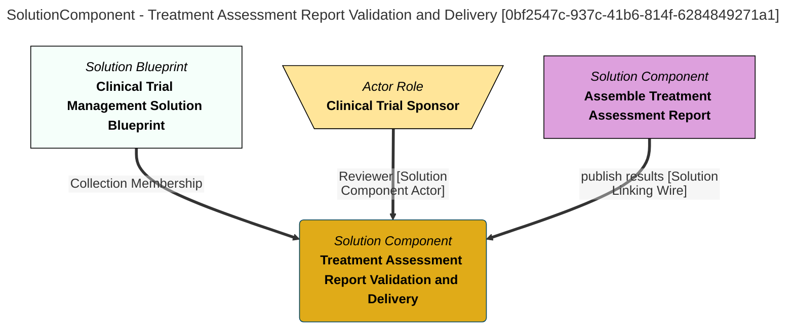

```mermaid
---
title: SolutionComponent - Treatment Assessment Report Validation and Delivery [0bf2547c-937c-41b6-814f-6284849271a1]
---
flowchart TD
%%{init: {"flowchart": {"htmlLabels": false}} }%%

1@{ shape: rounded, label: "*Solution Component*
**Treatment Assessment Report Validation and Delivery**"}
2@{ shape: rect, label: "*Solution Blueprint*
**Clinical Trial Management Solution Blueprint**"}
2==>|"Collection Membership"|1
3@{ shape: trap-t, label: "*Actor Role*
**Clinical Trial Sponsor**"}
3==>|"Reviewer [Solution Component Actor]"|1
4@{ shape: rect, label: "*Solution Component*
**Assemble Treatment Assessment Report**"}
4==>|"publish results [Solution Linking Wire]"|1
style 1 color:#000000, fill:#e0ab18, stroke:#004563
style 2 color:#000000, fill:#f5fffa, stroke:#000000
style 3 color:#000000, fill:#FFE599, stroke:#000000
style 4 color:#000000, fill:#dda0dd, stroke:#000000
```
> Treatment Assessment Report Validation and Delivery: An expert review, presentation, discussions relating to the results of the clinical trial. (Extracted from V1.0)
