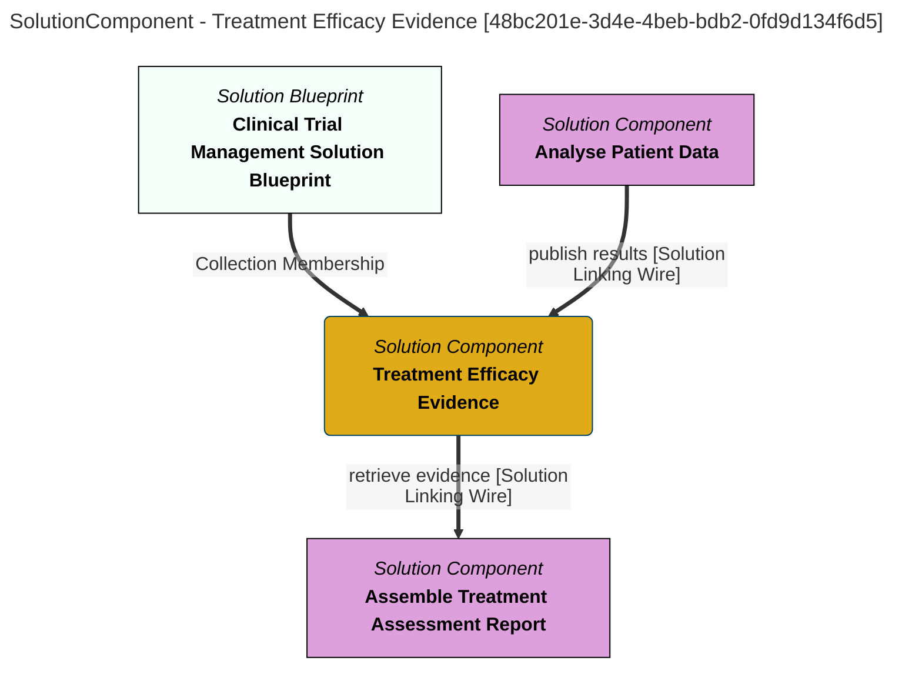

```mermaid
---
title: SolutionComponent - Treatment Efficacy Evidence [48bc201e-3d4e-4beb-bdb2-0fd9d134f6d5]
---
flowchart TD
%%{init: {"flowchart": {"htmlLabels": false}} }%%

1@{ shape: rounded, label: "*Solution Component*
**Treatment Efficacy Evidence**"}
2@{ shape: rect, label: "*Solution Blueprint*
**Clinical Trial Management Solution Blueprint**"}
2==>|"Collection Membership"|1
3@{ shape: rect, label: "*Solution Component*
**Assemble Treatment Assessment Report**"}
1==>|"retrieve evidence [Solution Linking Wire]"|3
4@{ shape: rect, label: "*Solution Component*
**Analyse Patient Data**"}
4==>|"publish results [Solution Linking Wire]"|1
style 1 color:#000000, fill:#e0ab18, stroke:#004563
style 2 color:#000000, fill:#f5fffa, stroke:#000000
style 3 color:#000000, fill:#dda0dd, stroke:#000000
style 4 color:#000000, fill:#dda0dd, stroke:#000000
```
> Treatment Efficacy Evidence: Assembly of the data required by the regulator. (Extracted from V1.0)
