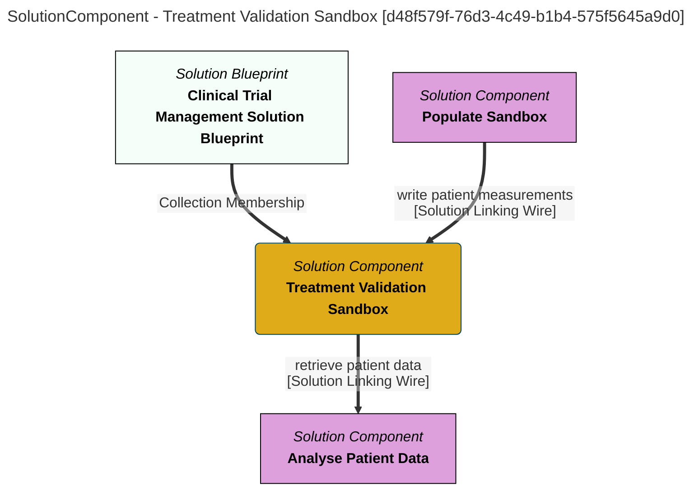

```mermaid
---
title: SolutionComponent - Treatment Validation Sandbox [d48f579f-76d3-4c49-b1b4-575f5645a9d0]
---
flowchart TD
%%{init: {"flowchart": {"htmlLabels": false}} }%%

1@{ shape: rounded, label: "*Solution Component*
**Treatment Validation Sandbox**"}
2@{ shape: rect, label: "*Solution Blueprint*
**Clinical Trial Management Solution Blueprint**"}
2==>|"Collection Membership"|1
3@{ shape: rect, label: "*Solution Component*
**Populate Sandbox**"}
3==>|"write patient measurements [Solution Linking Wire]"|1
4@{ shape: rect, label: "*Solution Component*
**Analyse Patient Data**"}
1==>|"retrieve patient data [Solution Linking Wire]"|4
style 1 color:#000000, fill:#e0ab18, stroke:#004563
style 2 color:#000000, fill:#f5fffa, stroke:#000000
style 3 color:#000000, fill:#dda0dd, stroke:#000000
style 4 color:#000000, fill:#dda0dd, stroke:#000000
```
> Treatment Validation Sandbox: A postgreSQL database schema for assembling data needed to validate the clinical trial. (Extracted from V1.0)
