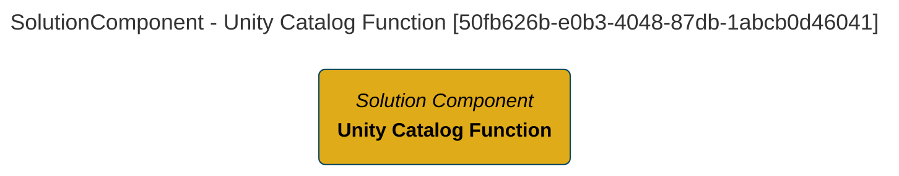

```mermaid
---
title: SolutionComponent - Unity Catalog Function [50fb626b-e0b3-4048-87db-1abcb0d46041]
---
flowchart TD
%%{init: {"flowchart": {"htmlLabels": false}} }%%

1@{ shape: rounded, label: "*Solution Component*
**Unity Catalog Function**"}
style 1 color:#000000, fill:#e0ab18, stroke:#004563
click 1 "https://github.com/unitycatalog/unitycatalog" "Click for more documentation" _blank
```
> Unity Catalog Function: A function found in Unity Catalog (UC) that is working with data. (Extracted from 6.0-SNAPSHOT)
