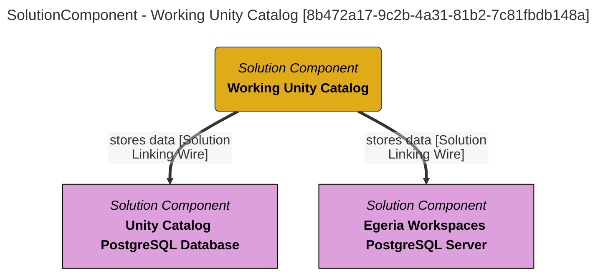

```mermaid
---
title: SolutionComponent - Working Unity Catalog [8b472a17-9c2b-4a31-81b2-7c81fbdb148a]
---
flowchart TD
%%{init: {"flowchart": {"htmlLabels": false}} }%%

1@{ shape: rounded, label: "*Solution Component*
**Working Unity Catalog**"}
2@{ shape: rect, label: "*Solution Component*
**Unity Catalog PostgreSQL Database**"}
1==>|"stores data [Solution Linking Wire]"|2
3@{ shape: rect, label: "*Solution Component*
**Egeria Workspaces PostgreSQL Server**"}
1==>|"stores data [Solution Linking Wire]"|3
style 1 color:#000000, fill:#e0ab18, stroke:#004563
style 2 color:#000000, fill:#dda0dd, stroke:#000000
style 3 color:#000000, fill:#dda0dd, stroke:#000000
click 1 "https://www.unitycatalog.io/" "Click for more documentation" _blank
click 2 "https://www.postgresql.org/" "Click for more documentation" _blank
click 3 "https://www.postgresql.org/" "Click for more documentation" _blank
```
> Working Unity Catalog: Open Source version of Unity Catalog backed by a PostgreSQL database.  Initialized with no content. (Extracted from 6.0-SNAPSHOT)
