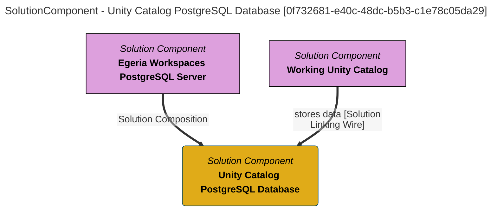

```mermaid
---
title: SolutionComponent - Unity Catalog PostgreSQL Database [0f732681-e40c-48dc-b5b3-c1e78c05da29]
---
flowchart TD
%%{init: {"flowchart": {"htmlLabels": false}} }%%

1@{ shape: rounded, label: "*Solution Component*
**Unity Catalog PostgreSQL Database**"}
2@{ shape: rect, label: "*Solution Component*
**Egeria Workspaces PostgreSQL Server**"}
2==>|"Solution Composition"|1
3@{ shape: rect, label: "*Solution Component*
**Working Unity Catalog**"}
3==>|"stores data [Solution Linking Wire]"|1
style 1 color:#000000, fill:#e0ab18, stroke:#004563
style 2 color:#000000, fill:#dda0dd, stroke:#000000
style 3 color:#000000, fill:#dda0dd, stroke:#000000
click 1 "https://www.postgresql.org/" "Click for more documentation" _blank
click 2 "https://www.postgresql.org/" "Click for more documentation" _blank
click 3 "https://www.unitycatalog.io/" "Click for more documentation" _blank
```
> Unity Catalog PostgreSQL Database: This database supports the catalog storage for Unity Catalog. (Extracted from 6.0-SNAPSHOT)
