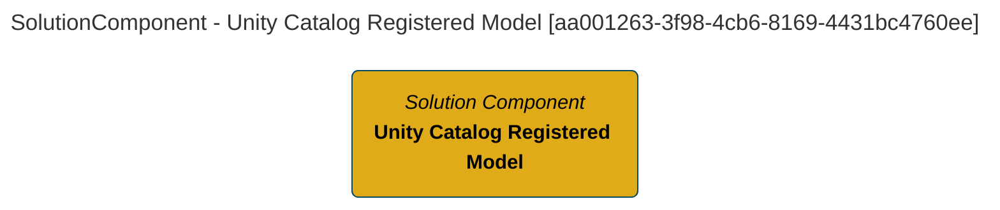

```mermaid
---
title: SolutionComponent - Unity Catalog Registered Model [aa001263-3f98-4cb6-8169-4431bc4760ee]
---
flowchart TD
%%{init: {"flowchart": {"htmlLabels": false}} }%%

1@{ shape: rounded, label: "*Solution Component*
**Unity Catalog Registered Model**"}
style 1 color:#000000, fill:#e0ab18, stroke:#004563
click 1 "https://github.com/unitycatalog/unitycatalog" "Click for more documentation" _blank
```
> Unity Catalog Registered Model: An analytics model deployed to Unity Catalog (UC). (Extracted from 6.0-SNAPSHOT)
