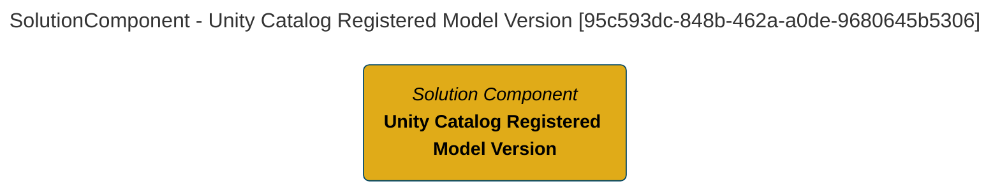

```mermaid
---
title: SolutionComponent - Unity Catalog Registered Model Version [95c593dc-848b-462a-a0de-9680645b5306]
---
flowchart TD
%%{init: {"flowchart": {"htmlLabels": false}} }%%

1@{ shape: rounded, label: "*Solution Component*
**Unity Catalog Registered Model Version**"}
style 1 color:#000000, fill:#e0ab18, stroke:#004563
click 1 "https://github.com/unitycatalog/unitycatalog" "Click for more documentation" _blank
```
> Unity Catalog Registered Model Version: A version of an analytics model deployed to Unity Catalog (UC). (Extracted from 6.0-SNAPSHOT)
