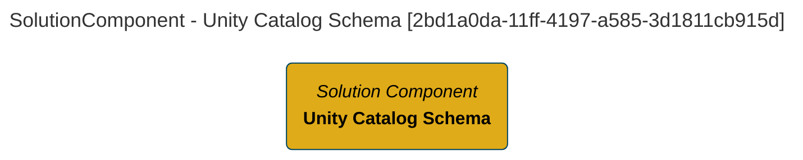

```mermaid
---
title: SolutionComponent - Unity Catalog Schema [2bd1a0da-11ff-4197-a585-3d1811cb915d]
---
flowchart TD
%%{init: {"flowchart": {"htmlLabels": false}} }%%

1@{ shape: rounded, label: "*Solution Component*
**Unity Catalog Schema**"}
style 1 color:#000000, fill:#e0ab18, stroke:#004563
click 1 "https://github.com/unitycatalog/unitycatalog" "Click for more documentation" _blank
```
> Unity Catalog Schema: A schema that organizes data assets for an operational data platform catalog within the Unity Catalog (UC) ''catalog of catalogs''. (Extracted from 6.0-SNAPSHOT)
