```mermaid
---
title: SolutionComponent - Unity Catalog Server [e9d51678-4377-41cb-8415-959886530933]
---
flowchart TD
%%{init: {"flowchart": {"htmlLabels": false}} }%%

1@{ shape: rounded, label: "*Solution Component*
**Unity Catalog Server**"}
2@{ shape: rect, label: "*Solution Blueprint*
**Unity Catalog Content Pack**"}
2==>|"Collection Membership"|1
3@{ shape: rect, label: "*Solution Component*
**Provision Unity Catalog Resource**"}
3==>|"works with [Solution Linking Wire]"|1
4@{ shape: rect, label: "*Solution Component*
**Unity Catalog Asset Exchange**"}
4==>|"Catalog Resource [Solution Linking Wire]"|1
5@{ shape: rect, label: "*Solution Component*
**Survey Unity Catalog Catalog**"}
5==>|"works with [Solution Linking Wire]"|1
6@{ shape: rect, label: "*Solution Component*
**Unity Catalog Server Exchange**"}
6==>|"Catalog Resource [Solution Linking Wire]"|1
7@{ shape: rect, label: "*Solution Component*
**Survey Unity Catalog Schema**"}
7==>|"works with [Solution Linking Wire]"|1
8@{ shape: rect, label: "*Solution Component*
**Survey Unity Catalog Volume**"}
8==>|"works with [Solution Linking Wire]"|1
9@{ shape: stadium, label: "*Solution Linking Wire*
**... plus 1 Items**"}
9-.->1
10@{ shape: stadium, label: "*Solution Linking Wire*
**... plus 1 Items**"}
10-.->1
style 1 color:#000000, fill:#e0ab18, stroke:#004563
style 2 color:#000000, fill:#f5fffa, stroke:#000000
style 3 color:#000000, fill:#dda0dd, stroke:#000000
style 4 color:#000000, fill:#dda0dd, stroke:#000000
style 5 color:#000000, fill:#dda0dd, stroke:#000000
style 6 color:#000000, fill:#dda0dd, stroke:#000000
style 7 color:#000000, fill:#dda0dd, stroke:#000000
style 8 color:#000000, fill:#dda0dd, stroke:#000000
style 9 color:#000000, fill:#F9F7ED, stroke:#b7c0c7
style 10 color:#000000, fill:#F9F7ED, stroke:#b7c0c7
click 1 "https://github.com/unitycatalog/unitycatalog" "Click for more documentation" _blank
click 3 "https://egeria-project.org/concepts/governance-action-type/" "Click for more documentation" _blank
click 4 "https://egeria-project.org/concepts/integration-connector/" "Click for more documentation" _blank
click 5 "https://egeria-project.org/concepts/governance-action-type/" "Click for more documentation" _blank
click 6 "https://egeria-project.org/concepts/integration-connector/" "Click for more documentation" _blank
click 7 "https://egeria-project.org/concepts/governance-action-type/" "Click for more documentation" _blank
click 8 "https://egeria-project.org/concepts/governance-action-type/" "Click for more documentation" _blank
```

> Unity Catalog Server: The OSS Unity Catalog (UC) Server is an operational data platform ''catalog of catalogs'' that supports controlled access to data managed through a related data platforms. (Extracted from 6.0-SNAPSHOT)
