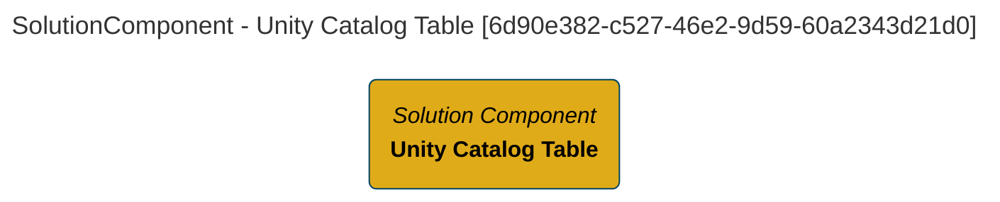

```mermaid
---
title: SolutionComponent - Unity Catalog Table [6d90e382-c527-46e2-9d59-60a2343d21d0]
---
flowchart TD
%%{init: {"flowchart": {"htmlLabels": false}} }%%

1@{ shape: rounded, label: "*Solution Component*
**Unity Catalog Table**"}
style 1 color:#000000, fill:#e0ab18, stroke:#004563
click 1 "https://github.com/unitycatalog/unitycatalog" "Click for more documentation" _blank
```
> Unity Catalog Table: A relational table within the Unity Catalog (UC) ''catalog of catalogs''. (Extracted from 6.0-SNAPSHOT)
