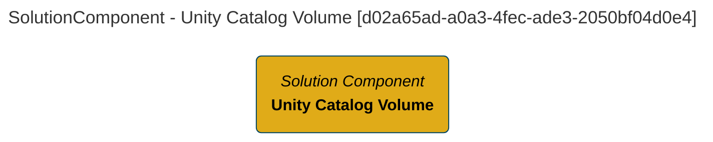

```mermaid
---
title: SolutionComponent - Unity Catalog Volume [d02a65ad-a0a3-4fec-ade3-2050bf04d0e4]
---
flowchart TD
%%{init: {"flowchart": {"htmlLabels": false}} }%%

1@{ shape: rounded, label: "*Solution Component*
**Unity Catalog Volume**"}
style 1 color:#000000, fill:#e0ab18, stroke:#004563
click 1 "https://github.com/unitycatalog/unitycatalog" "Click for more documentation" _blank
```
> Unity Catalog Volume: A collection of related data files within the Unity Catalog (UC) ''catalog of catalogs''. (Extracted from 6.0-SNAPSHOT)
