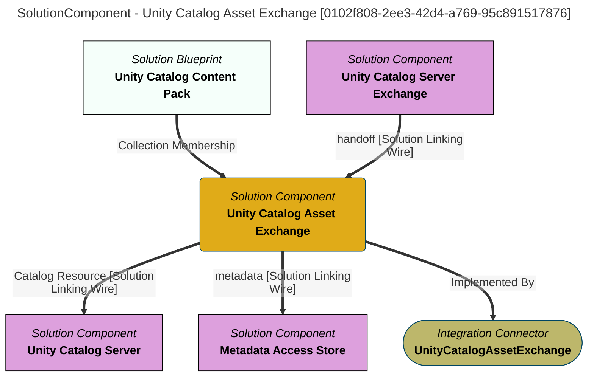

> Unity Catalog Asset Exchange: Exchanges the metadata found in a Unity Catalog Catalog with the open metadata ecosystem.  The open metadata ecosystem can provide enrichment of the description of Unity Catalog assets and search across Unity Catalog server instances.  It can also be used to provision new assets to Unity Catalog. (Extracted from 6.0-SNAPSHOT)
