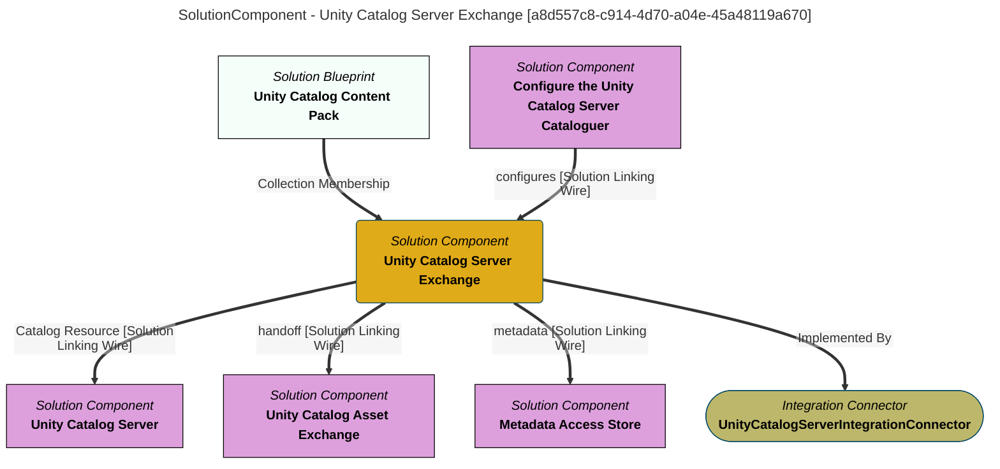

> Unity Catalog Server Exchange: Maintains the open metadata description of the catalogs found in the Unity Catalog servers linked through CatalogTarget relationships.  It hands off the cataloguing of the assets within each catalog to the ''Unity Catalog Asset Exchange''.  New catalogs linked to the metadata element for a Unity Catalog server are automatically provisioned to the corresponding Unity Catalog server instance. (Extracted from 6.0-SNAPSHOT)
