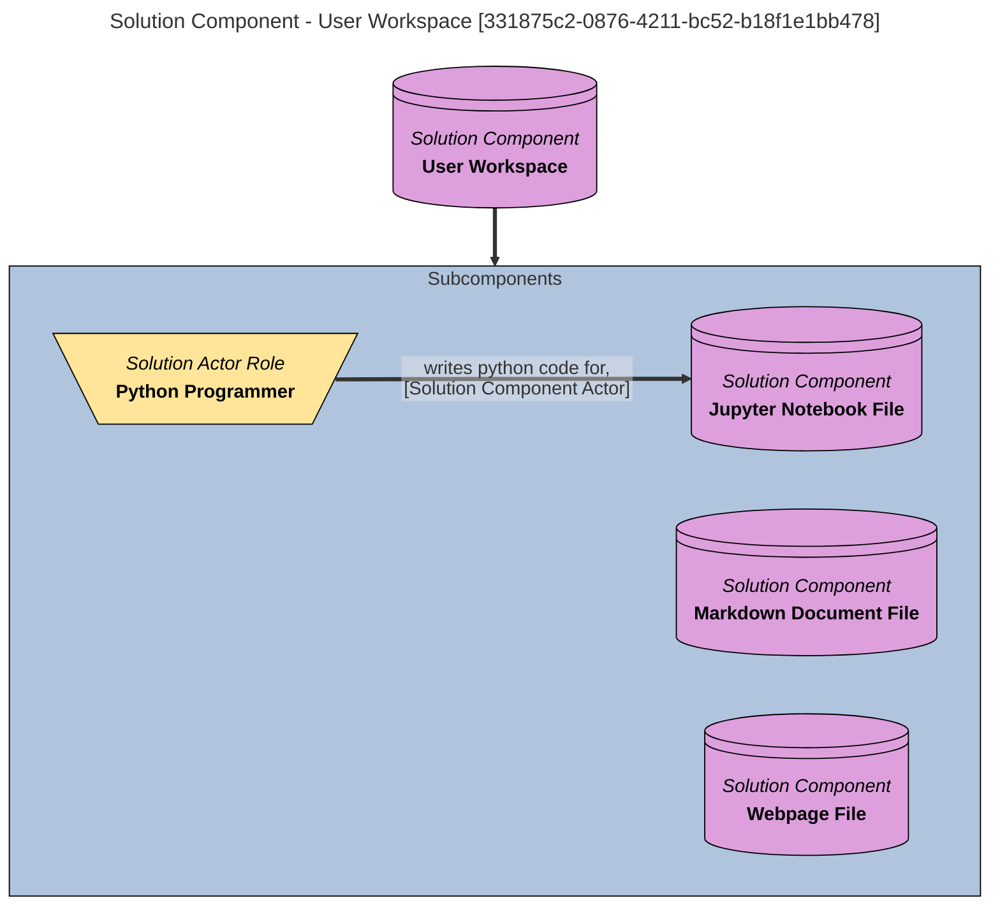

```mermaid
---
title: Solution Component - User Workspace [331875c2-0876-4211-bc52-b18f1e1bb478]
---
flowchart TD
%%{init: {"flowchart": {"htmlLabels": false}} }%%

1@{ shape: lin-cyl, label: "*Solution Component*
**User Workspace**"}
subgraph 2 [Subcomponents]
3@{ shape: lin-cyl, label: "*Solution Component*
**Jupyter Notebook File**"}
4@{ shape: lin-cyl, label: "*Solution Component*
**Markdown Document File**"}
5@{ shape: lin-cyl, label: "*Solution Component*
**Webpage File**"}
6@{ shape: trap-t, label: "*Solution Actor Role*
**Python Programmer**"}
6==>|"writes python code for,
[Solution Component Actor]"|3
end
1==>2
style 1 color:#000000, fill:#dda0dd, stroke:#000000
style 2 color:#000000, fill:#b0c4de, stroke:#000000
style 3 color:#000000, fill:#dda0dd, stroke:#000000
style 4 color:#000000, fill:#dda0dd, stroke:#000000
style 5 color:#000000, fill:#dda0dd, stroke:#000000
style 6 color:#000000, fill:#FFE599, stroke:#000000
click 3 "https://jupyter.org/" "Click for more documentation" _blank
click 4 "https://en.wikipedia.org/wiki/Markdown" "Click for more documentation" _blank
click 5 "https://en.wikipedia.org/wiki/HTML" "Click for more documentation" _blank
```
> User Workspace: Directory on the file systems where a user can store their files. (Extracted from 6.0-SNAPSHOT)
