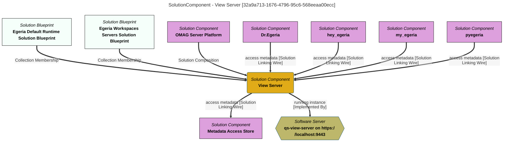

```mermaid
---
title: SolutionComponent - View Server [32a9a713-1676-4796-95c6-568eeaa00ecc]
---
flowchart TD
%%{init: {"flowchart": {"htmlLabels": false}} }%%

1@{ shape: rounded, label: "*Solution Component*
**View Server**"}
2@{ shape: rect, label: "*Solution Blueprint*
**Egeria Default Runtime Solution Blueprint**"}
2==>|"Collection Membership"|1
3@{ shape: rect, label: "*Solution Blueprint*
**Egeria Workspaces Servers Solution Blueprint**"}
3==>|"Collection Membership"|1
4@{ shape: rect, label: "*Solution Component*
**OMAG Server Platform**"}
4==>|"Solution Composition"|1
5@{ shape: rect, label: "*Solution Component*
**Dr.Egeria**"}
5==>|"access metadata [Solution Linking Wire]"|1
6@{ shape: rect, label: "*Solution Component*
**hey_egeria**"}
6==>|"access metadata [Solution Linking Wire]"|1
7@{ shape: rect, label: "*Solution Component*
**Metadata Access Store**"}
1==>|"access metadata [Solution Linking Wire]"|7
8@{ shape: rect, label: "*Solution Component*
**my_egeria**"}
8==>|"access metadata [Solution Linking Wire]"|1
9@{ shape: rect, label: "*Solution Component*
**pyegeria**"}
9==>|"access metadata [Solution Linking Wire]"|1
10@{ shape: hex, label: "*Software Server*
**qs-view-server on https:/ /localhost:9443**"}
1==>|"running instance [Implemented By]"|10
style 1 color:#000000, fill:#e0ab18, stroke:#004563
style 2 color:#000000, fill:#f5fffa, stroke:#000000
style 3 color:#000000, fill:#f5fffa, stroke:#000000
style 4 color:#000000, fill:#dda0dd, stroke:#000000
style 5 color:#000000, fill:#dda0dd, stroke:#000000
style 6 color:#000000, fill:#dda0dd, stroke:#000000
style 7 color:#000000, fill:#dda0dd, stroke:#000000
style 8 color:#000000, fill:#dda0dd, stroke:#000000
style 9 color:#000000, fill:#dda0dd, stroke:#000000
style 10 color:#000000, fill:#bdb76b, stroke:#004563
click 1 "https://egeria-project.org/concepts/metadata-access-server/" "Click for more documentation" _blank
click 4 "https://egeria-project.org/concepts/omag-server-platform/" "Click for more documentation" _blank
click 6 "https://egeria-project.org/user-interfaces/hey-egeria/overview/" "Click for more documentation" _blank
click 7 "https://egeria-project.org/concepts/metadata-access-store/" "Click for more documentation" _blank
click 9 "https://egeria-project.org/concepts/pyegeria/" "Click for more documentation" _blank
click 10 "https://egeria-project.org/concepts/view-server/" "Click for more documentation" _blank
```
> View Server: A server that provides access to end user open metadata and governance services. (Extracted from 6.0-SNAPSHOT)
