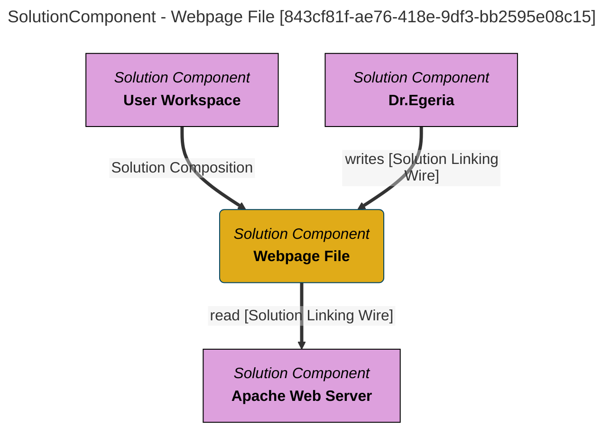

```mermaid
---
title: SolutionComponent - Webpage File [843cf81f-ae76-418e-9df3-bb2595e08c15]
---
flowchart TD
%%{init: {"flowchart": {"htmlLabels": false}} }%%

1@{ shape: rounded, label: "*Solution Component*
**Webpage File**"}
2@{ shape: rect, label: "*Solution Component*
**User Workspace**"}
2==>|"Solution Composition"|1
3@{ shape: rect, label: "*Solution Component*
**Dr.Egeria**"}
3==>|"writes [Solution Linking Wire]"|1
4@{ shape: rect, label: "*Solution Component*
**Apache Web Server**"}
1==>|"read [Solution Linking Wire]"|4
style 1 color:#000000, fill:#e0ab18, stroke:#004563
style 2 color:#000000, fill:#dda0dd, stroke:#000000
style 3 color:#000000, fill:#dda0dd, stroke:#000000
style 4 color:#000000, fill:#dda0dd, stroke:#000000
click 1 "https://en.wikipedia.org/wiki/HTML" "Click for more documentation" _blank
click 4 "https://httpd.apache.org/" "Click for more documentation" _blank
```
> Webpage File: Text file encoded using HTML tags plus optional script tags, such as JavaScript and CSS. (Extracted from 6.0-SNAPSHOT)
